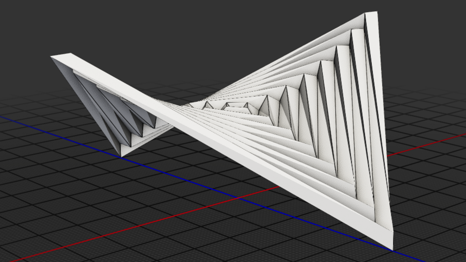

# Origami Hyperbolic Paraboloid
 
Hyperbolic paraboloids are architectural masterworks of structural efficiency, allowing architects to create vast, dramatic spaces.
Known mathematically as a doubly-ruled saddle surface, this shape’s unique geometry allows a curved structure to be built entirely out of straight beams.
The [origami version](https://erikdemaine.org/hypar/hypar_folding.pdf) is particularly impressive when it comes to conceptual architecture that probably would not be very practical in the real world. 
